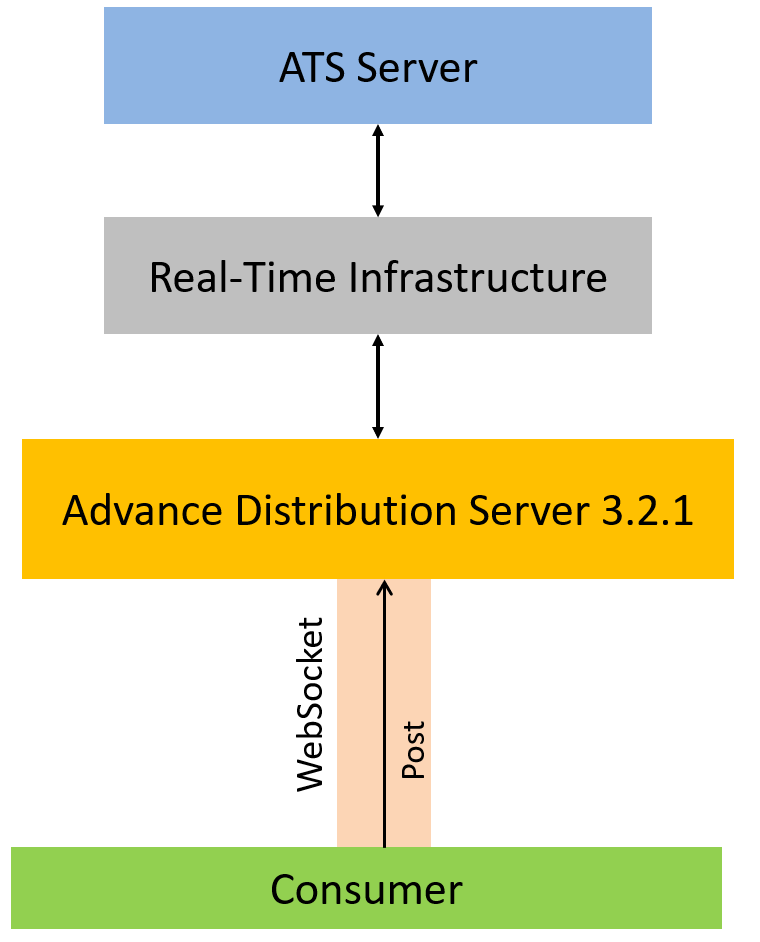
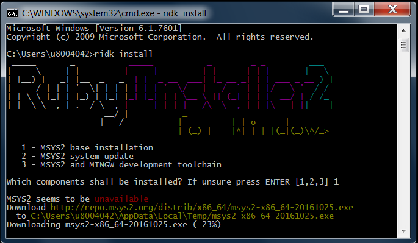
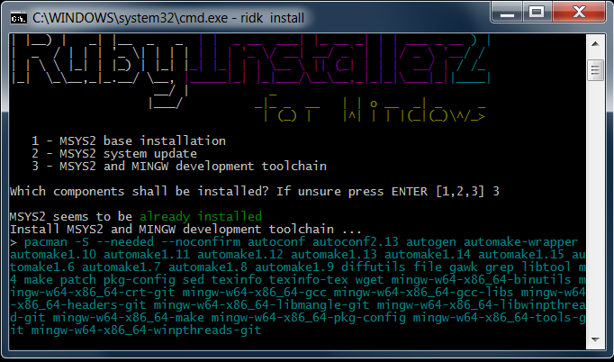

# The Websocket API for Pricing Streaming and Real-Time Service Posting to ATS example with Ruby

## Overview

**Update**: February 2021

[Websocket API for Pricing Streaming and Real-Time Service](https://developers.refinitiv.com/elektron/websocket-api) (aka Websocket API, formerly known as Elektron WebSocket API)  enables easy integration into a multitude of client technology environments such as scripting and web.  This API runs directly on your Refinitiv Real-Time Distribution System and presents data in an open (JSON) readable format. The API supports all Refinitiv Real-Time data models and can be integrated into multiple client technology standards e.g. JavaScript, Python, R, .Net etc.

This article covers how to implement the WebSocket client application to create, update market price data and delete the ATS server's contribution RIC via Refinitiv Real-Time Advanced Distribution Server 3.2.1 (and above) with Posting feature. 

The example application is implemented with Ruby language, but the main concept and JSON post message structures are the same for all technologies. 

*Note: The initial release of this API is for deployed Real-Time Advanced infrastructure customers only (i.e. to use it you will need an installed version of Real-Time Advanced Distribution Server 3.2.1 and above).

## ATS Overview

Refinitiv Real-time's Advanced Transformation System (ATS) is an analytical server that brings real-time data together from multiple sources, including internal contributed data, and transforms, centrally calculates, and publishes the resulting data onto the platform for further distribution and consumption by other applications and users.

## Posting Overview

Through posting, API consumers can easily push content into any cache within the Refinitiv Real-Time infrastructure  (i.e., an HTTP POST request). Data contributions/inserts into the ATS or publishing into a cache offer similar capabilities today. When posting, API consumer applications reuse their existing sessions to publish content to any cache(s) residing within the Refinitiv Real-Time infrastructure (i.e., service provider(s) and/or infrastructure components). When compared to spreadsheets or other applications, posting offers a more efficient form of publishing, because the application does not need to create a separate provider session or manage event streams. The posting capability, unlike unmanaged publishing or inserts, offers optional acknowledgments per posted message. The two types of posting are on-stream and off-stream:
  * **On-Stream Post**: Before sending an on-stream post, the client must first open (request) a data stream for an item. After opening the data stream, the client application can then send a post. The route of the post is determined by the route of the data stream.
  * **Off-Stream Post**: In an off-stream post, the client application can send a post for an item via a Login stream, regardless of whether a data stream first exists. The route of the post is determined by the Core Infrastructure (i.e., ADS, ADH, etc.) configuration.



This example covers only how to use the Off-Stream Post to contribute item to ATS server.

## Prerequisite 
1. Real-Time Advanced Distribution Server server 3.2.1 (and above) with WebSocket connection
2. ATS server
3. The Real-Time Advanced Distribution Server/Real-Time Advanced Data Hub server musts contain the ATS fields definition in the RDMFieldDictionary file.
```
X_RIC_NAME                "RIC NAME"                    -1      NULL    ALPHANUMERIC    32  RMTES_STRING    32
```
4. [Ruby](https://www.ruby-lang.org/en/) compiler and runtime
5. Ruby [websocket-client-simple](https://rubygems.org/gems/websocket-client-simple) library 
6. Ruby [ipaddress](https://rubygems.org/gems/ipaddress) library 
7. Ruby [http](https://rubygems.org/gems/http) library 
8. Internet Connection

## Project Structure
This example project contains the following files and folders
1. src/market_price_postapp.rb: The example application file.
2. example_msgs/ folder:  example JSON messages between application and ADS WebSocket files
3. README.md: The application readme file
4. note.md: The application implementation note file

## Project Setup
1. Unzip or download the example project folder into a directory of your choice 
2. Install required Ruby libraries via the following commands
```
gem install websocket-client-simple
gem install ipaddress
gem install http
```
3. If you are using Windows, you can download Ruby Installer via [Ruby Installer](https://rubyinstaller.org/downloads/) web site. 
4. If you are using Windows, you need to install [MSYS2](http://www.msys2.org/) toolkit (bundled with Ruby Installer) development toolchain in order to install Ruby [http](https://rubygems.org/gems/http) library via the following steps
    - Then run the ```ridk install``` command in a command prompt
    - Select 1 **MSYS2 base installation** to install MSYS2 toolkit

    
    - Then select 3 **MSYS2 and MINGW development toolchain** to install required development libraries. 

    

    - Note: You may need to run ```ridk enable``` command before ```ridk install```.

## How to run this example application

Once all dependencies and environment have been setup, you can run the example application with the following steps:

1. Open a command prompt and go to **&lt;project&gt;src** folder and run the following command

```
$> ruby market_price_postapp.rb [--hostname hostname ] [--port WebSocket port] [--app_id appID] [--user user] [--action {{create, addfields, removefields, delete, update}}]
```
## Example Results

### Create ATS contribution RIC example JSON message
```
SENT:
{
  "ID": 1,
  "Type": "Post",
  "Domain": "MarketPrice",
  "Ack": true,
  "PostID": 1,
  "PostUserInfo": {
    "Address": "10.42.68.162",
    "UserID": 5656
  },
  "Key": {
    "Name": "ATS_INSERT_S",
    "Service": 668
  },
  "Message": {
    "ID": 0,
    "Type": "Refresh",
    "Domain": "MarketPrice",
    "Fields": {
      "X_RIC_NAME": "CREATED.RIC",
      "BID": 12,
      "ASK": 15
    }
  }
}
RECEIVED:
[
  {
    "ID": 1,
    "Type": "Ack",
    "AckID": 1,
    "Text": "[4]: Creation Accepted",
    "Key": {
      "Service": "API_ATS",
      "Name": "ATS_INSERT_S"
    }
  }
]
```
### Update market price data to contribution RIC example
```
SENT:
{
  "ID": 1,
  "Type": "Post",
  "Domain": "MarketPrice",
  "Ack": true,
  "PostID": 1,
  "PostUserInfo": {
    "Address": "10.42.68.162",
    "UserID": 9108
  },
  "Key": {
    "Name": "CREATED.RIC",
    "Service": 668
  },
  "Message": {
    "ID": 0,
    "Type": "Update",
    "Domain": "MarketPrice",
    "Fields": {
      "BID": 43,
      "ASK": 46
    }
  }
}
RECEIVED:
[
  {
    "ID": 1,
    "Type": "Ack",
    "AckID": 1,
    "Text": "[1]: Contribution Accepted",
    "Key": {
      "Service": "API_ATS",
      "Name": "CREATED.RIC"
    }
  }
]
```
## Implementation Detail

Please see [Implementation Note file](./note.md) for more detail.

## References
For further details, please check out the following resources:
* [Refinitiv Real-Time & Distribution Family page](https://developers.refinitiv.com/en/use-cases-catalog/refinitiv-real-time) on the [Refinitiv Developer Community](https://developers.refinitiv.com/) web site.
* [WebSocket API page](https://developers.refinitiv.com/en/api-catalog/elektron/refinitiv-websocket-api).
* [Developer Webinar Recording: Introduction to  WebSocket API](https://www.youtube.com/watch?v=CDKWMsIQfaw)
* [WebSocket technology](https://www.websocket.org/index.html) web site.
* [Developer Article: Consume Realtime data with Refinitiv Data Platform](https://developers.refinitiv.com/en/article-catalog/article/consume-real-time-data-with-refinitiv-data-platform)
* [Developer Article: How to implement WebSocket API JavaScript application with HTML Web Workers](https://developers.refinitiv.com/en/article-catalog/article/how-implement-elektron-websocket-api-javascript-application-html-web-workers)
* [Developer Article: How to implement WebSocket API JavaScript application with TypeScript](https://developers.refinitiv.com/en/article-catalog/article/how-to-implement-elektron-websocket-api-javascript-application-typescript)
* [Developer Article: Consuming Order Book Level 2 data with Websocket API](https://developers.refinitiv.com/en/article-catalog/article/consuming-order-book-level-2-data-with-elektron-websocket-api)

For any questions related to this article or the WebSocket API page, please use the Developer Community [Q&A Forum](https://community.developers.refinitiv.com/spaces/152/websocket-api.html).